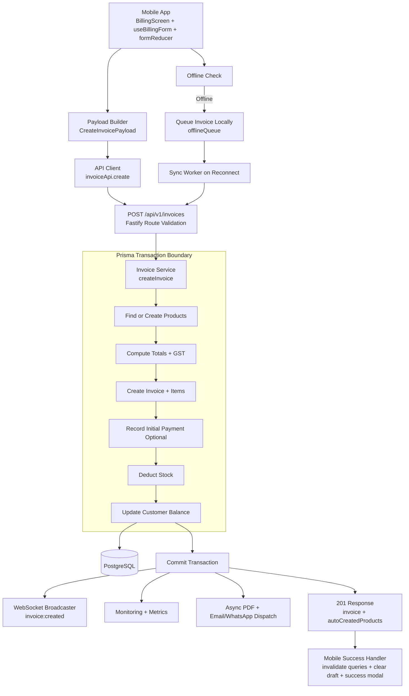
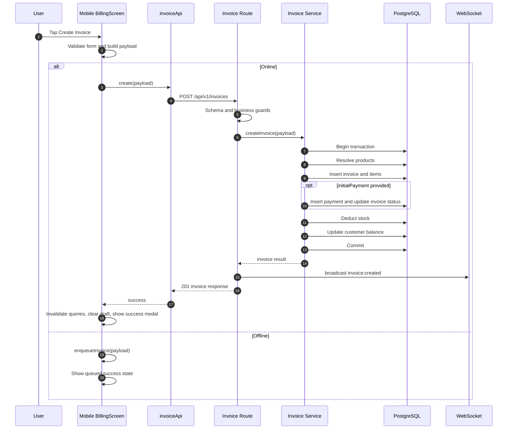
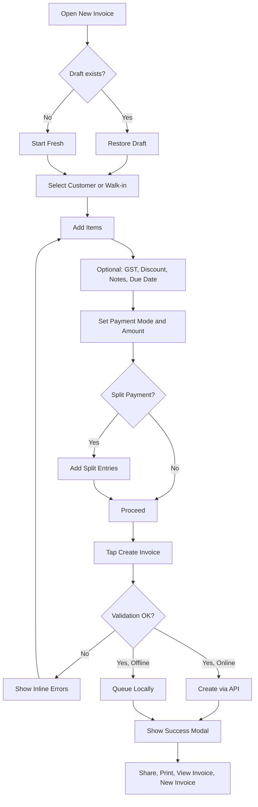

# Create Invoice Diagrams

Status: Draft v1 (April 3, 2026)
Scope: Mobile create-invoice flow and backend execution path.

## 1) System Architecture

## 2) Runtime Sequence

## 3) User Flow

## Source Anchors

- apps/mobile/src/features/billing/screens/BillingScreen.tsx
- apps/mobile/src/features/billing/hooks/useBillingForm.ts
- apps/mobile/src/features/billing/lib/formReducer.ts
- apps/api/src/api/routes/invoice.routes.ts
- packages/modules/src/modules/invoice/invoice.service.ts
- apps/mobile/src/lib/offlineQueue.ts
- apps/mobile/src/shared/hooks/useOffline.ts
- docs/product/PRODUCT_REQUIREMENTS.md (Section 13)
